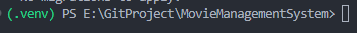

# 项目构建

## 构建虚拟环境

在项目根目录下打开终端, 执行下面的命令将 python 环境拷贝到当前项目目录中. 我的 python 环境是由 miniconda 管理, 所以 python 解释器的路径为 `D:\miniconda\miniconda_3\envs\django\python.exe`. 将该路径替换为你的 python 解释器的路径即可(python版本为 3.10)

```
D:\miniconda\miniconda_3\envs\django\python.exe -m venv .venv
```

## 激活虚拟环境

在项目根目录下, 将会有一个 .venv 文件夹, 这是由上一步得到的. 在 `.venv/Scripts` 中有三个脚本, 如果是使用 powershell(vscode 的默认终端), 将 Activate.ps1 拖到终端中然后运行即可. 激活后路径前会有一个 (.venv) 前缀, 例如



## 安装 django 和 mysqlclient

在上一步的基础上, 运行下列命令完成安装

```
pip install django
pip install mysqlclient
```

## 创建数据库

本项目使用 mysql 作为数据库后端, 使用数据库名称为 **moviemanagement**. 所以首先需要登录 mysql 在本地建立一个数据库, 在 mysql 中使用如下命令创建一个空的数据库:

```
create database moviemanagement character set utf8;
```

## 配置数据库

在 django 中配置数据库, 使得 django 可以连接到上一步中建立的数据库. 我准备了一个模板文件 **db_usr_template.cnf**. 复制该文件到项目根目录中, 修改名称为 **db_usr.cnf**. 然后修改 **db_usr.cnf** 中的内容为自己 mysql 的配置, 即用户名(一般为 root)与密码

## 数据库迁移

执行如下命令, 如果没有报错说明配置成功.

```
python manage.py migrate
```